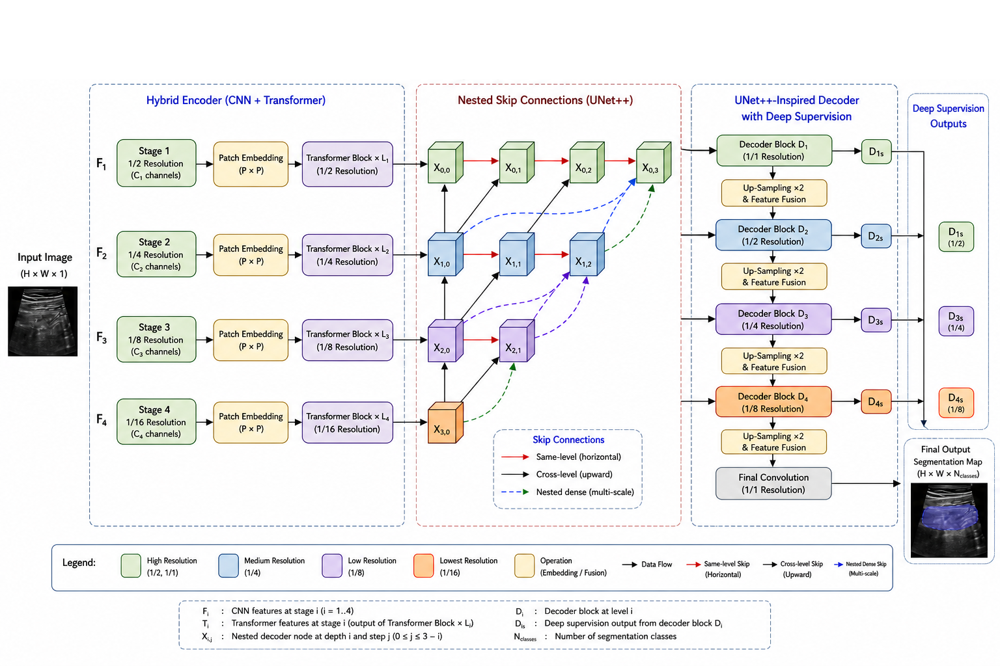

# TransUNet++ README

## Overview

TransUNet++ is an enhanced medical image segmentation framework based on TransUNet, redesigned with a UNet++ nested decoder for stronger feature fusion and improved segmentation accuracy.

This project combines:

*   CNN Backbone (ResNet50 / ConvNeXt / EfficientNet)
*   Vision Transformer (ViT) encoder
*   UNet++ Nested Decoder
*   Deep Supervision Heads
*   Binary / Multi-class segmentation support

## Key Contributions

### 1. Hybrid Encoder

Feature extraction begins with a CNN backbone:

*   ResNet50
*   ConvNeXt
*   EfficientNet-B3 / B4

Then features are tokenized and processed by Vision Transformer.

### 2. Transformer Encoder

Captures long-range dependencies and global context better than standard CNN-only models.

### 3. UNet++ Nested Decoder

Instead of the classical U-Net decoder, this project introduces:

*   Dense skip pathways
*   Progressive multi-scale refinement
*   Better semantic fusion
*   Improved boundary recovery

### 4. Deep Supervision

Auxiliary segmentation heads are added at intermediate decoder levels:

*   Faster convergence
*   Better gradient flow
*   Improved generalization

## Architecture



## Project Structure

```
TransUNet/
│── networks/
│   ├── vit_seg_configs.py
│   ├── vit_seg_modeling.py
│   ├── vit_seg_modeling_nested.py
│   ├── vit_seg_modeling_resnet_skip.py
│
│── train.py
│── test.py
│── trainer.py
│── datasets/
│── model/
│── README.md
```

## Configurations Added

### New Models

*   R50-ViT-B_16-Plus
*   ConvNeXt-ViT-B_16-Plus
*   EfficientNet-B3-ViT-B_16-Plus

These activate:

```
config.use_nested_decoder = True
```

## Installation

```bash
git clone https://github.com/yourusername/TransUNetPlusPlus.git
cd TransUNetPlusPlus
pip install -r requirements.txt
```

## Training

### Kaggle / GPU Example

```bash
python train.py \
    --dataset Synapse \
    --vit_name R50-ViT-B_16-Plus \
    --max_epochs 15 \
    --n_skip 3 \
    --base_lr 0.01 \
    --batch_size 8
```

## Testing

```bash
python test.py \
    --vit_name R50-ViT-B_16-Plus \
    --n_skip 3 \
    --num_classes 2 \
    --snapshot_path ./model/best_model.pth
```

## Supported Datasets

*   Synapse
*   ISIC
*   Custom Medical Datasets

## Why TransUNet++?

Compared to TransUNet:

| Model         | Decoder           | Feature Fusion    | Accuracy |
| :------------ | :---------------- | :---------------- | :------- |
| TransUNet     | Standard U-Net    | Basic             | Good     |
| TransUNet++   | UNet++ Nested     | Dense Multi-scale | Better   |

### Experimental Benefits

Observed during training:

*   Better Dice Score
*   Better IoU
*   Sharper masks
*   Faster convergence
*   Better small object detection

## Citation


```
@misc{transunetplusplus,
  title={TransUNet++: Vision Transformer with Nested UNet Decoder},
  author={Hossam EL-Mossaid},
  year={2026}
}
```
